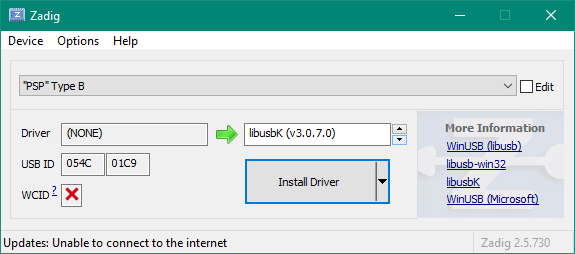

# CWUSB - How to use

## Linux
1. Copy [AdHocToUSB.prx](https://github.com/plus11/adhoctousb-guide/tree/main/AdhocToUSB) to /SEPLUGINS on the PSP
2. Create or open /SEPLUGINS/GAME.TXT
3. Add 

   ```ms0:/seplugins/AdhocToUSB.prx 1``` (for PSP 1000/2000/3000) 

   or 

   ``` ef0:/seplugins/AdhocToUSB.prx 1``` (for PSP GO)
\
   ```bash
   touch /media/username/nameofPSP/SEPLUGINS/GAME.TXT \
   && echo "ms0:/seplugins/AdhocToUSB.prx 1" \
   >> /media/username/nameofPSP/SEPLUGINS/GAME.TXT
   ```

4. Start a game on the PSP
5. Start [XLink Kai](http://teamxlink.co.uk/) on the PC
    1. Follow steps on [XLink Kai Debian Guide](https://repo.teamxlink.co.uk/) or download the binary from the [download page](https://www.teamxlink.co.uk/go?c=download), after downloading: 
    
       ```bash
       tar xvf kaiEngine-*.tar.gz \
       && cd "$(ls -f | grep kaiEngine | grep -v *.tar.gz)" \
       && sudo chmod 755 ./kaiengine \
       && sudo setcap cap_net_admin,cap_net_raw=eip ./kaiengine \
       && ./kaiengine
       ```
6. Start CWUSB 
   ```bash
   sudo chmod 755 ./cwusb && sudo ./cwusb
   ```
7. Enter the arena on XLink Kai you want to play on [WebUI](http://127.0.0.1:34522/) and enjoy!

\newpage

## Windows 
1. Copy [AdHocToUSB.prx](https://github.com/plus11/adhoctousb-guide/tree/main/AdhocToUSB) to \\SEPLUGINS on the PSP
2. Create or open \\SEPLUGINS\\GAME.TXT
3. Add

   ```ms0:/seplugins/AdhocToUSB.prx 1``` (for PSP 1000/2000/3000) 

   or 

   ``` ef0:/seplugins/AdhocToUSB.prx 1``` (for PSP GO)

4. Start a game on the PSP
5. Download [Zadig](https://zadig.akeo.ie/) and install the libusbK driver:



(note: if you do not see the psp, try going to Options->List all Devices)


6. Start [XLink Kai](http://teamxlink.co.uk/) on the PC
    1. Download [here](https://www.teamxlink.co.uk/go?c=download)
    2. Install XLink Kai by running the downloaded exe
    3. Run XLink Kai, by hitting Start and searching for 'Start XLink Kai'
7. Start CWUSB
8. Enter the arena on XLink Kai you want to play on [WebUI](http://127.0.0.1:34522/) and enjoy!

\newpage

## macOS
1. Copy [AdHocToUSB.prx](https://github.com/plus11/adhoctousb-guide/tree/main/AdhocToUSB) to /SEPLUGINS on the PSP
2. Create or open /SEPLUGINS/GAME.TXT
3. Add 

   ```ms0:/seplugins/AdhocToUSB.prx 1``` (for PSP 1000/2000/3000) 

   or 

   ``` ef0:/seplugins/AdhocToUSB.prx 1``` (for PSP GO)

4. Start a game on the PSP
5. Start [XLink Kai](http://teamxlink.co.uk/) on the PC
    1. Download the package from the [download page](https://www.teamxlink.co.uk/go?c=download), after downloading, follow [these](https://www.teamxlink.co.uk/wiki/Installing_on_macOS) steps
6. Open terminal and navigate to where cwusb is saved, then:
   ```bash
   sudo chmod 755 ./cwusb
   ```
7. Now double click on cwusb
8. Enter the arena on XLink Kai you want to play on [WebUI](http://127.0.0.1:34522/) and enjoy!

\newpage

## Troubleshooting
- I'm getting an error about: MSVCP140.dll, VCRUNTIME140.dll or VCRUNTIME140_1.dll
   - Install [Microsoft Visual C++ Redistributable for Visual Studio 2015, 2017 and 2019](https://aka.ms/vs/16/release/vc_redist.x64.exe)
   
- I'm getting an error about: "Operation not supported or unimplemented on this platform"
   - The libUSBK driver is not installed correctly, make sure the plugin is enabled and a game is running when installing the driver using Zadig
   
- Receivebuffer got to over 50! or Sendbuffer got to over 50! ?
   - This is a normal warning, there could be some added latency while playing
 
- Could set configuration: Entity not found
   - This usually happens when you installed the wrong driver, reinstall the driver
